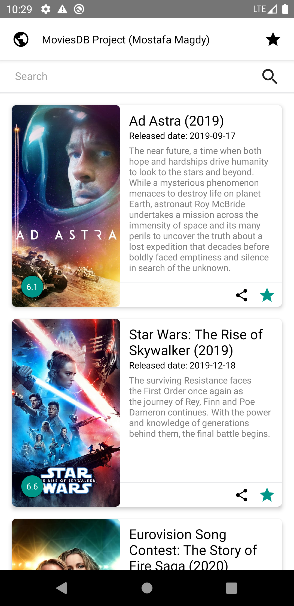
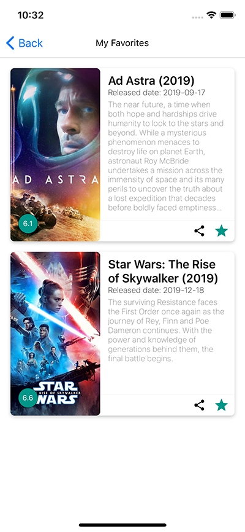

To setup this application on your system first run the following command:
`yarn`.

To run this application on iOS device use `react-native run-ios` and for android use `react-native run-android`.

## About DB and APIs
TMDB was used for searching the movies.
At first create developers account on TMDB and then generate your API key. Using this key you can search movies.

Two APIS were used in this project:
* https://api.themoviedb.org/3/search/movie?query=jungle&api_key={your key} - To search movies.
* https://api.themoviedb.org/3/movie/{movieID}?api_key={your key} - To get detailed information about a particular movie.

## React-Native Packages Used
    "@react-native-community/async-storage": "^1.11.0",
    "@react-native-community/netinfo": "^5.9.4",
    "axios": "^0.19.2",
    "prop-types": "^15.7.2",
    "react": "16.11.0",
    "react-native": "0.62.2",
    "react-native-gesture-handler": "^1.6.1",
    "react-native-reanimated": "^1.9.0",
    "react-native-router-flux": "^4.2.0",
    "react-native-screens": "^2.9.0",
    "react-native-share": "^3.6.0",
    "react-native-splash-screen": "^3.2.0",
    "react-native-vector-icons": "^6.6.0",
    "rn-fetch-blob": "^0.12.0"
    
## Screenshots

